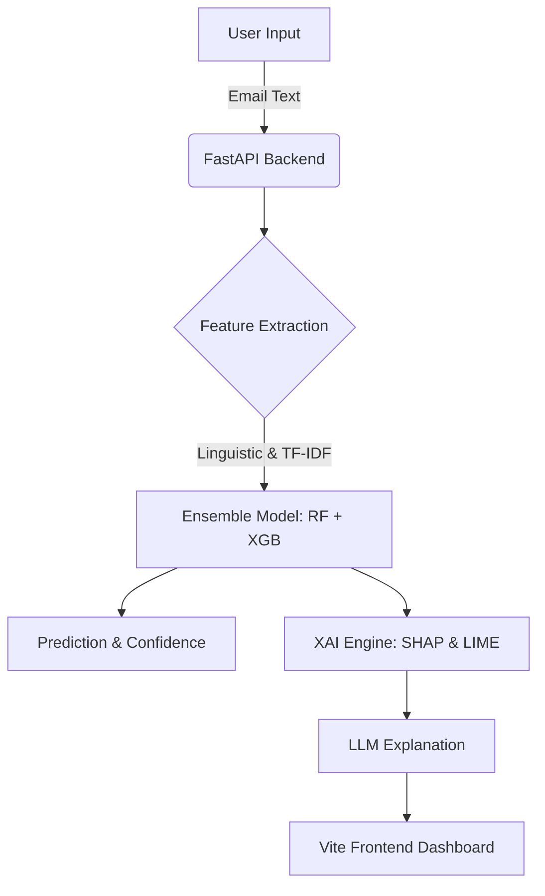

# PhishShield-XAI: Adversarial Phishing Detection

### Authors:
- **Muhammad Hashir**
- **Amber Khurshid**


[](https://fastapi.tiangolo.com/)
[](https://www.python.org/)
[](https://scikit-learn.org/)
[](https://xgboost.ai/)

**PhishShield-XAI** is an industrial-grade, adversarial-resistant phishing detection platform. It combines high-capacity ensemble machine learning with **Explainable AI (XAI)** to provide security analysts with real-time, transparent threat intelligence.

## 🌟 Key Features

- **🛡️ Adversarial Hardening**: Trained on 1000+ stealthy, LLM-generated phishing samples designed to evade traditional filters.
- **🧠 Explainable AI (SHAP & LIME)**:
  - **SHAP**: Global feature importance (why the model thinks an email is suspicious).
  - **LIME**: Local word-level highlights (identifying specific malicious tokens in the text).
- **🚀 Real-Time API**: High-performance FastAPI backend with sub-50ms inference time.
- **🎨 Glassmorphic Dashboard**: A modern, responsive web interface for real-time email analysis.
- **📈 Adaptive Defense**: Built-in "Arms Race" simulator to measure and improve evasion resistance.

## 🏗️ Project Architecture



## 📂 Repository Structure

- `src/`: Core logic (API, Engine, XAI, Simulator).
- `web/`: Frontend dashboard (Vite + Vanilla JS).
- `data/`: Raw and adversarial datasets.
- `models/`: Serialized model artifacts.
- `notebooks/`: Research pipeline and pipeline documentation.
- `scripts/`: Automation for training, testing, and demos.

## 🚀 Quick Start

### 1. Setup Environment
```bash
chmod +x setup.sh run.sh
./setup.sh
```

### 2. Launch Platform
```bash
./run.sh
```

## 🧪 Testing & Verification
We have included a rigorous test suite of 16 complex scenarios (Homographs, BEC, Shortened URLs). Run it with:
```bash
./venv/bin/python scripts/rigorous_test.py
```

## 📄 License
This project is licensed under the MIT License - see the [LICENSE](LICENSE) file for details.
