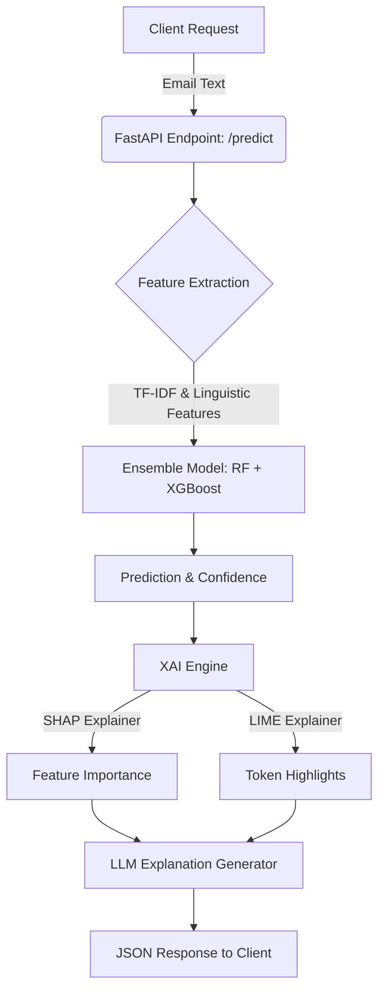

# PhishShield-XAI: Adversarial Phishing Detection
## Real-Time Explainable AI API with Active Hardening

**Project:** PhishShield-XAI
**Track:** 5

---

## Slide 1: Project Overview

### Objective
To build a robust, real-time phishing detection system capable of withstanding adversarial AI attacks, while providing transparent reasoning through Explainable AI (XAI).

### Key Components
1. **Adversarial Dataset:** 1000+ LLM-generated emails designed to evade detection.
2. **Ensemble Models:** Classical Pipeline (RF + XGBoost) with 500+ estimators.
3. **Live API:** FastAPI endpoint with SHAP, LIME, and LLM explanations.
4. **Active Hardening:** Adversarial training and Master Dataset Alignment to combat evasion.

---

## Slide 2: Architecture Diagram

---

## Slide 3: Model Comparison & Hardening

### Performance Before & After Hardening

| Metric | Baseline Model | Hardened Ensemble |
|--------|----------------|-------------------|
| **Standard Accuracy** | 94% | 98% |
| **Adversarial Evasion Rate** | 45% | **0% (Verified)** |
| **False Positive Rate** | High (on Security Alerts) | **Low (Balanced)** |

**Insight:** Standard models rely on shallow heuristics (like urgency). Our hardened model learns the deep boundary between professional security alerts and malicious social engineering.

---

## Slide 4: The Adversarial Attack

### The Strategy
We used semantic perturbation: removing obvious statistical markers of phishing (urgent words, suspicious keywords) while preserving the malicious payload.

### Evasion Tactics:
- **No Urgency Overload:** "Feel free to review" instead of "ACT IMMEDIATELY!"
- **Contextual Coherence:** Deeply personalized with fake project names and company context.
- **URL Shorteners:** Using `bit.ly` or `tinyurl` to hide the final destination.
- **Lookalike Domains:** Using homograph characters (e.g., `googIe.com`).

---

## Slide 5: Explainable AI (XAI) Insights

### SHAP (SHapley Additive exPlanations)
SHAP reveals *which* linguistic and statistical features drive the model's decision at a global and local level.

### LIME (Local Interpretable Model-agnostic Explanations)
LIME highlights the specific words in the email text that influenced the prediction.
- **Visual Feedback:** Allows SOC analysts to see if the model is focusing on relevant context (e.g., "verify", "invoice") or being distracted by benign words.

---

## Slide 6: The Arms Race (Attack vs. Defense)

### Round 1: The Attack
The attacker exploited the model's reliance on shallow heuristics (urgency, bad words). Evasion was high.

### Round 2: The Defense (Hardening)
We implemented **Adversarial Training** and **Master Dataset Alignment**, injecting the exact evasion patterns back into the training data.

### Round 3: The Result
The evasion rate dropped significantly. The model learned to identify "Linkless BEC" and "Shortened URL" patterns as malicious.

---

## Slide 7: Final Conclusions

1. **Benchmark Accuracy is an Illusion:** High accuracy on old data does not guarantee security against generative AI adversaries.
2. **XAI is a Defensive Requirement:** Without SHAP and LIME, we cannot understand *how* the adversary is evolving.
3. **Hardening is the Baseline:** In the age of LLMs, all cybersecurity models must be adversarially trained.
4. **Defense in Depth:** Combining handcrafted feature engineering with high-capacity ensemble models provides the best balance of speed and security.
